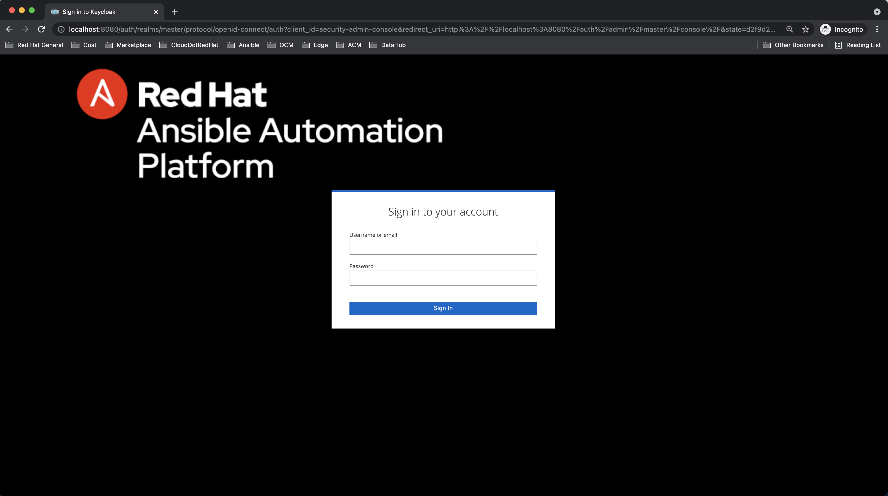

# aap-keycloak-theme
Create a keycloak theme for the Ansible Automation Platform


# Development

This project uses docker-compose to start a Keycloak instance and Postgres database so that the developed theme can be loaded and tested.

1.  Start the containers:
```
docker-compose up
```

The **ansible** theme under "keycloak_data/themes/ansible" is mapped into the Keycloak container at "/opt/jboss/keycloak/themes/ansible".

2. Launch Keycloak
Login to keycloak at http://localhost:8080

3. Create Realm

Hover over "Master" realm in left-hand navigation and click "Add Realm". Name the realm and save.

4. Set login theme

Choose the Themes tab. In the "Login Theme" drop down select **ansible**.

5. Launch Sign-in

Select Clients from left-hand navigation. Click the Base URL for the account client to launch a new tab.
In the top right corner choose "Sign In" and see the login theme.

# Login Theme

The results of the login theme are as follows:

